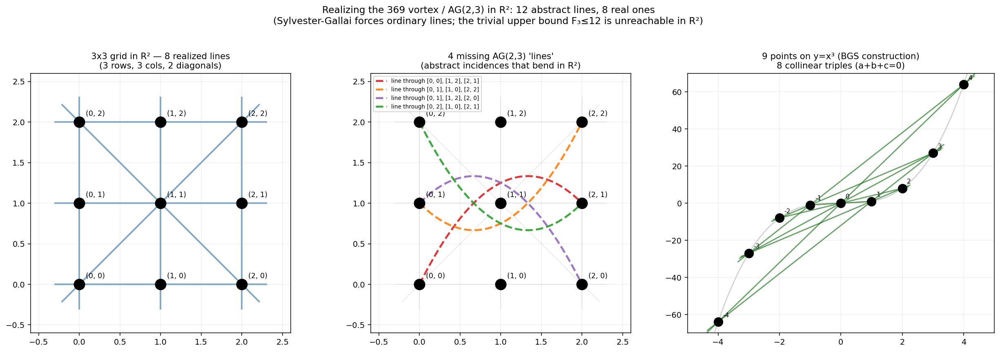

# Line incidences in the plane: AG(2,3), Sylvester–Gallai, and the orchard problem

A self-directed computational study of the Erdős function **F_k(n)** — the
maximum number of lines through at least *k* of *n* points in the plane — for
the smallest interesting case, *k* = 3. The project reaches the classical
results (Sylvester–Gallai, the Burr–Grünbaum–Sloane lower bound, and the
Green–Tao orchard optima) from scratch, verifies them in code, and characterises
why a natural heuristic search stalls below the known optimum.

## The question

Given *n* points in R², let

- **F_k(n)** = number of lines through **at least** *k* points,
- **f_k(n)** = number of lines through **exactly** *k* points.

Every pair of points determines at most one line, and a *k*-point line uses up
C(*k*, 2) pairs, so there is a trivial upper bound

```
F_k(n) ≤ C(n, 2) / C(k, 2).
```

For *n* = 9, *k* = 3 this is F_3(9) ≤ 36 / 3 = **12**. The natural question:
does any real configuration of 9 points attain it?

## Result 1 — the abstract optimum exists, but not over R

The affine plane **AG(2, 3)** has 9 points and 12 lines of 3, with every pair on
a unique line. As an abstract incidence structure it *saturates* the bound:
F_3 = 12. So the combinatorics permit 12 — the obstruction, if any, is geometric.

Embedding AG(2, 3) as the 3×3 integer grid in R² and counting incidences
exactly (`src/incidences.py`) gives:

| Configuration            | f_2 | f_3 | F_3 | bound |
|--------------------------|-----|-----|-----|-------|
| 3×3 grid in R²           | 12  |  8  |  8  | 12    |
| 9 points on *y = x³*     | 12  |  8  |  8  | 12    |
| AG(2, 3), abstract       |  0  | 12  | 12  | 12    |

Only **8 of the 12** abstract lines survive as straight lines in R². The four
that fail are the "wrap-around" lines of the torus (Z/3)² — they close up modulo
3 but bend in the plane:

```
(0,0) (1,2) (2,1)
(0,1) (1,0) (2,2)
(0,1) (1,2) (2,0)
(0,2) (1,0) (2,1)
```

This gap is not an artefact of the grid. It is the **Sylvester–Gallai theorem**
(conjectured 1893, proved by Gallai 1944): every finite, non-collinear point set
in R² has at least one *ordinary* line through exactly two points. A real
AG(2, 3) would have zero ordinary lines, which is impossible. AG(2, q) realises
only over finite fields, or in the complex projective plane (the Hesse
configuration for *q* = 3), never over R for *q* ≥ 2.



## Result 2 — the lower bound that *is* tight

The **Burr–Grünbaum–Sloane** construction (1974) gives F_3(n) ≥ n²/6 − O(n) by
placing points on a cubic curve, where three points are collinear iff their
parameters sum to zero in the curve's group law. For the degenerate cubic
*y = x³* this is just Vieta's formula. The code verifies it:

| n  | f_3 on *y = x³* | n²/6 | bound C(n,2)/3 |
|----|-----------------|------|----------------|
| 9  | 8               | 13.5 | 12             |
| 12 | 15              | 24   | 22             |

A *smooth* elliptic curve does better still, thanks to torsion points that
contribute extra zero-sum triples. None of these beat the trivial bound — that
is reserved for AG-type configurations that only live over finite fields or C.

## Result 3 — where a heuristic search stalls (the orchard problem)

Counting lines through *exactly* 3 points is the **orchard problem**, whose
optima *t₃(n)* are known: t₃(9) = 10, t₃(11) = 16, t₃(12) = 19 (the *n* = 11, 12
values from Green–Tao, 2013). I built a continuous-space local search (anchored
descent from the Pappus 9-point configuration, adding extra points at
intersections of incidence lines) to try to reach these optima.

The search reliably finds **f₃ = 15 at n = 11** but does not reach the optimum
of 16. To be precise: 16 *is* achievable — it is the proven optimum — but it is
unreachable *by this search from the Pappus basin*, which is a different claim
from impossibility. Characterising *why* turned out to be the interesting part:
the Green–Tao optimal configuration lives in a different, algebraically defined
basin (its 16th line requires the explicit Green–Tao construction at the seed
level). A full-relaxation annealing run from the f₃ = 15 configuration accepted
**0 of 30,000 proposed moves**, an empirical demonstration that the Pappus and
Green–Tao basins are separated by a barrier the search cannot cross. This is a
clean illustration of a general phenomenon: local optimisation recovers
incidence structure within a basin but cannot cross between algebraically distant
constructions.

## Result 4 — attaining the proven optimum at n = 12 (projective construction)

The orchard optimum at n = 12 is **t₃(12) = 19**. A configuration attaining it
is included and verified here. The construction is projective: **11 ordinary
points plus one point at infinity** (the vertical direction). A point at infinity
is legitimate in the orchard problem — the problem lives in the projective plane,
and this configuration is projectively equivalent to 12 ordinary points, since a
projective transformation can move the point at infinity to a finite position
without disturbing a single incidence.

The 19 lines decompose as **15 + 4**: fifteen ordinary 3-point lines among the
11 affine points, plus four lines each consisting of a vertically-aligned pair
together with the vertical point at infinity. `src/verify_n12_projective.py`
reproduces this independently in homogeneous coordinates and confirms it holds at
strict tolerance (down to 1e-10) with **no 4-point lines**.

This **matches** the proven optimum; it does not beat it — 19 is the maximum at
n = 12 and cannot be exceeded. The result is reported as an independent,
strict-tolerance confirmation that the configuration is genuine.

## Running it

```bash
pip install -r requirements.txt
python src/incidences.py            # AG(2,3), Sylvester-Gallai, BGS (Results 1-2)
python src/verify_n12_projective.py # attains t_3(12)=19, strictly verified (Result 4)
```

`incidences.py` reproduces every number in the tables above and prints the four
non-realizable AG(2, 3) lines. `verify_n12_projective.py` prints the f₃ counts
across tolerances and the 15 + 4 decomposition.

## Files

```
src/incidences.py             Exact F_k / f_k incidence counting; AG(2,3) and BGS checks
src/verify_n12_projective.py  Independent strict verification of the t_3(12)=19 optimum
figures/realization_gap.png   Abstract vs. real realization of AG(2,3)
docs/notes.md            Longer technical notes and references
```

## References

- J. J. Sylvester (1893); T. Gallai (1944) — the Sylvester–Gallai theorem.
- S. Burr, B. Grünbaum, N. Sloane, *The orchard problem*, Geometriae Dedicata (1974).
- B. Green, T. Tao, *On sets defining few ordinary lines*, Discrete & Computational Geometry (2013).

## Scope and honesty

This is a learning project, not new mathematics. It does not improve any known
bound — the n = 12 result *matches* the proven optimum t₃(12) = 19, it does not
exceed it. Its value is in reaching the classical theorems independently,
constructing and strictly verifying an optimal configuration, and pinning down
precisely why a natural search heuristic falls short of the optimum elsewhere.
